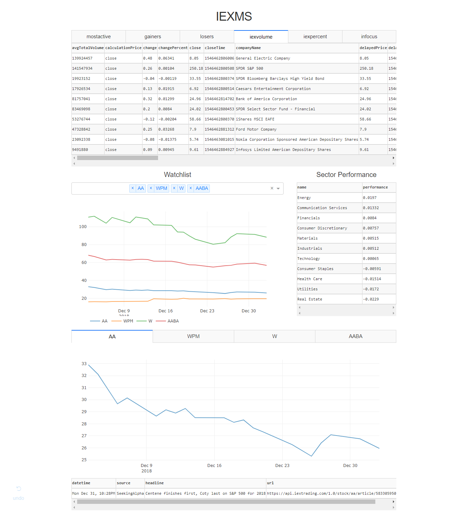

# iexms
> Python stock app using the IEX Developer API.

[](https://www.python.org/)
[](https://GitHub.com/Naereen/StrapDown.js/graphs/commit-activity)

IEXMS is a stock data app for hobby investors. 
The management system monitors financial market data and news in real time, 
and gives users the ability to manage watchlists and virtual portfolios. 

Data is obtained through the [IEX Developer API](https://iextrading.com/developer/)
and processed using [pandas](https://pandas.pydata.org/).

Interface is written using [Dash by Plotly](https://dash.plot.ly/).



## Installation

From dev repo:
```sh
git clone git@github.com:tw325/iexms.git
```

## Usage example

## Development setup
Dependencies:
- dash
- dash_core_components
- dash_html_components
- dash_table
- requests
- plotpy
- pandas

To install:
```sh
pip install dash
```

## Release History
* 0.0.1
    * Work in progress

## Meta

Tyler Wang – tw325@cornell.edu

[https://github.com/tw325](https://github.com/tw325/)

## Contributing

1. Fork it (<https://github.com/tw325/iexms/fork>)
2. Create your feature branch (`git checkout -b feature/fooBar`)
3. Commit your changes (`git commit -am 'Add some fooBar'`)
4. Push to the branch (`git push origin feature/fooBar`)
5. Create a new Pull Request
